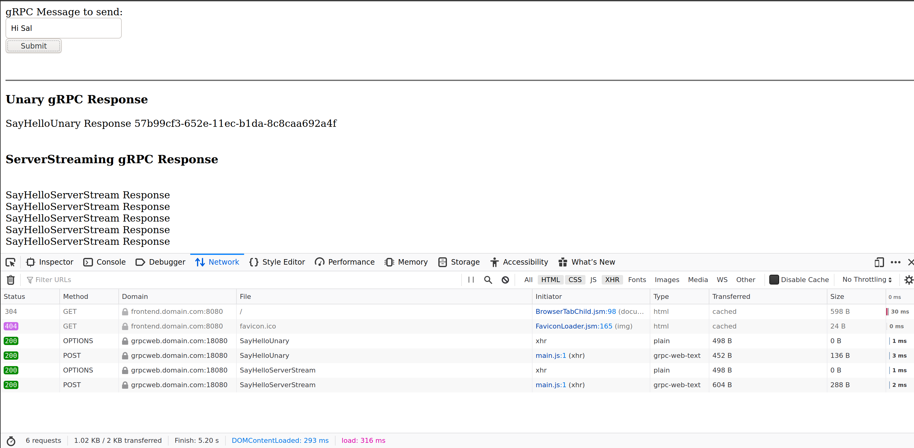
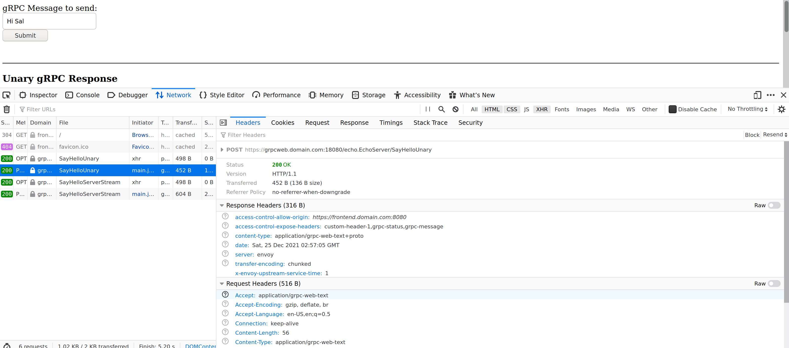

## gRPC Web and gRPC Transcoding with Envoy

This is a simple stand-alone set of configurations demonstrating both [gRPC Transcoding](https://google.aip.dev/127) and [gRPC-Web](https://github.com/grpc/grpc-web) using [Envoy Proxy](https://www.envoyproxy.io/).

This is actually nothing new and you can find a fair amount of references for each already pretty readily.  I decided to write it up all within one repository as a way to refresh my knowledge since the last time i made separate samples of each years ago: [grpc-transcoding-envoy](https://github.com/salrashid123/esp_docker/tree/master/grpc-transcoding-envoy), [grpc_web_with_gke](https://github.com/salrashid123/grpc_web_with_gke).

What this tutorial sets up is two independent configurations for envoy all using different mechanisms from the browser to talk to the gRPC server.

In the first, this tutorial demonstrates `gRPC Transcoding` where a simple gRPC client's api calls are made through REST

In the second, `gRPC Web` is used to show how to compile a `.proto` into javascript that runs on the browser. 

In both Envoy is used as a proxy for the transcoding and in the other, as an intermediary to convert grpc-web to grpc (and also to do CORS)

---

To use this, at a minimum you will need

* `Docker`
* `golang`

If you want to run all of this manually, you'll also need `node (10)` and `protoc (3.19.1)`

### Setup

Since this tutorial runs everything locally, we will need to setup some overrides to reference everything by DNS locally

edit `/etc/hosts`

```
127.0.0.1 frontend.domain.com grpc.domain.com transcoding.domain.com grpcweb.domain.com
```

The full layout of this tutorial is:

* `grpcServer`: this is a simple grpc server that will run at `grpc.domain.com:50051`
* `envoy`: for grpc_transcoding, envoy will run at `transcoding.domain.com:8080`

* `envoy` for grpc_web  will run at  `grpcweb.domain.com:18080`
* `frontend`: this is the frontend browser application for grpc_web and runs at `frontend.domain.com:8080`


First get Envoy

```bash
docker cp `docker create envoyproxy/envoy-dev:latest`:/usr/local/bin/envoy .
```

#### gRPC Client Server application

To get a sense of the gRPC app, lets run just the client-server by itself.

We will be using the gRPC server for the duration of this tutorial so keep that running

```bash
cd grpc_app/

## optionally compile (you don't need to do this since the repo contains this already)
# /usr/local/bin/protoc -I ./echo    --include_imports --include_source_info   --descriptor_set_out=echo/echo.proto.pb   --go_opt=paths=source_relative   --go_out=plugins=grpc:./echo/ echo/echo.proto

# run the client/server in different shells without TLS
go run greeter_server/grpc_server.go --grpcport :50051 --insecure  
go run greeter_client/grpc_client.go --host grpc.domain.com:50051 --insecure
```

```bash
# now run the client/server with TLS
go run greeter_server/grpc_server.go --grpcport :50051 --tlsCert certs/grpc_server_crt.pem --tlsKey certs/grpc_server_key.pem
go run greeter_client/grpc_client.go --host grpc.domain.com:50051 --cacert certs/tls-ca.pem --servername grpc.domain.com -skipHealthCheck
```

Build and run the docker images locally

```bash
docker build -t grpc_app .

docker run -p 50051:50051  -t grpc_app /grpc_server  \
    --grpcport :50051
    --tlsCert /certs/grpc_server_crt.pem  \
    --tlsKey /certs/grpc_server_key.pem

docker run --net=host --add-host grpc.domain.com:127.0.0.1    -t grpc_app /grpc_client  \
    --host=grpc.domain.com:50051 --cacert /certs/tls-ca.pem  \
    --servername grpc.domain.com
```

### gRPC Transcoding

For gRPC transcoding, please see the official documentation as well as the published specification [HTTP and gRPC Transcoding](https://google.aip.dev/127).


The layout of what we are running here is


so, create the transcoding image and run it

```bash
cd grpc_transcoding/
docker build -t envoy_transcoding .

docker run --net=host  -p 18080:18080 -t envoy_transcoding
```

Run the `grpc_server`
```bash
cd grpc_app
go run greeter_server/grpc_server.go --grpcport :50051 --tlsCert certs/grpc_server_crt.pem --tlsKey certs/grpc_server_key.pem
```

In a new shell, use `curl` and `REST` api calls to call the grpc server:

```bash
$ curl -s --cacert certs/tls-ca.pem -H "host: transcoding.domain.com" https://transcoding.domain.com:18080/echo.EchoServer/SayHelloUnary/hi
{
 "message": "SayHelloUnary Response cf466c3f-6509-11ec-bae1-8c8caa692a4f"
}
```

```bash
$ curl -s --cacert certs/tls-ca.pem -H "host: transcoding.domain.com" https://transcoding.domain.com:18080/echo.EchoServer/SayHelloServerStream/hi
[{
 "message": "SayHelloServerStream Response"
}
,{
 "message": "SayHelloServerStream Response"
}
,{
 "message": "SayHelloServerStream Response"
}
,{
 "message": "SayHelloServerStream Response"
}
,{
 "message": "SayHelloServerStream Response"
}
]
```

for POST, edit `echo.proto`, as shown, 

```proto
  rpc SayHelloUnary (EchoRequest) returns (EchoReply) {
    option (google.api.http) = {
      post: "/echo.EchoServer/SayHelloUnary"
    };  
  }
```

recompile the docker image and run

```bash
curl -vv --cacert certs/tls-ca.pem  \
   -H "host: transcoding.domain.com"     -H 'Content-Type: application/json'  \
   -d '{"name": "foo"}'  \
   https://transcoding.domain.com:18080/echo.EchoServer/SayHelloUnary

```


### gRPC Web

For grpc-web, there are more components involved


So create the frontend image that will include the protoc compiled javascript for grpc-web:

```bash
cd frontend/
docker build -t frontend  .

# now run the image
docker run --net=host -p 8080:8080 -t frontend

# run envoy
./envoy -c proxy.yaml
```

If you want, check if envoy is correctly returning the CORS headers:

```bash
curl -vk --cacert CA_crt.pem -H "Origin: https://frontend.domain.com:8080"     -H "Access-Control-Request-Method: GET"     -H "Access-Control-Request-Headers: Authorization, X-grpc-web"     -H "host: grpcweb.domain.com" -X OPTIONS  https://grpcweb.domain.com:18080/echo.EchoServer
```

Since we are running all this locally with our own custom certificates, we will need to include the CA that singed the certs into your browser.

So, in firefox, import `grpc_app/certs/tls-ca.pem` file into the trust store


Now, open up your browser and go to `https://frontend.doman.com:8080/`...note you should not see a certificate warning (if you do, please import the CA)

Once you go to the site, you'll see a simple text box.

What that textbox does is simply makes an CORS request to the envoy server and then makes a grpc-web call once its authorized:



The request and payload for the grpc-web calls are then made through envoy




---

#### References

* [https://medium.com/@denis.zhbankov/grpc-web-via-http2-b05c8c8f9e6](https://medium.com/@denis.zhbankov/grpc-web-via-http2-b05c8c8f9e6)
* [JSON/HTTP transcoding to gRPC using Envoy](https://errindam.medium.com/json-http-transcoding-to-grpc-using-envoy-934ffe343983)
* [Transcoding gRPC to HTTP/JSON](https://www.vijaykonnackal.com/json-grpc-transcoding/)
